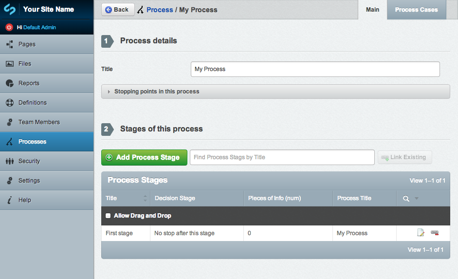

Processmap
==========================

A module to produce simple semi-linear process maps in silverstripe

Enables classification of the information pieces within each stage of a process, in order to apply filters, or style.

For more information, see the [User Docs](docs/en/userdocs.md)

