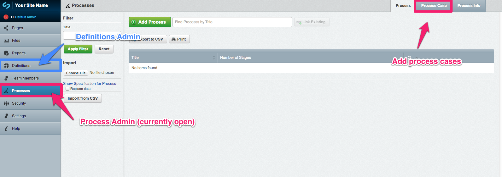
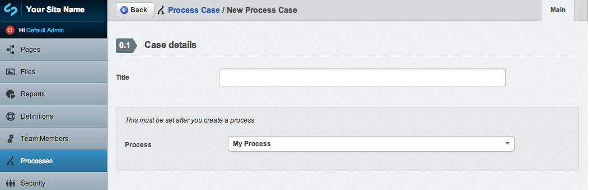
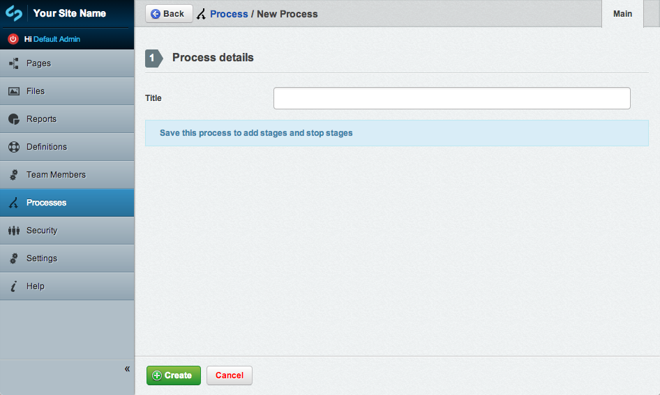
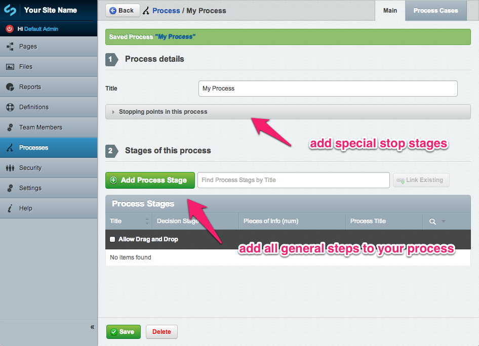
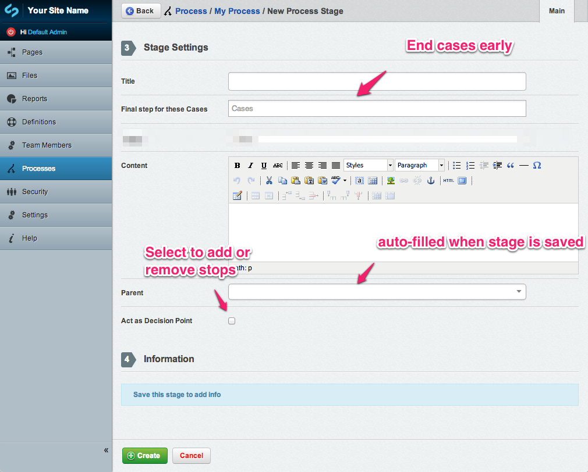
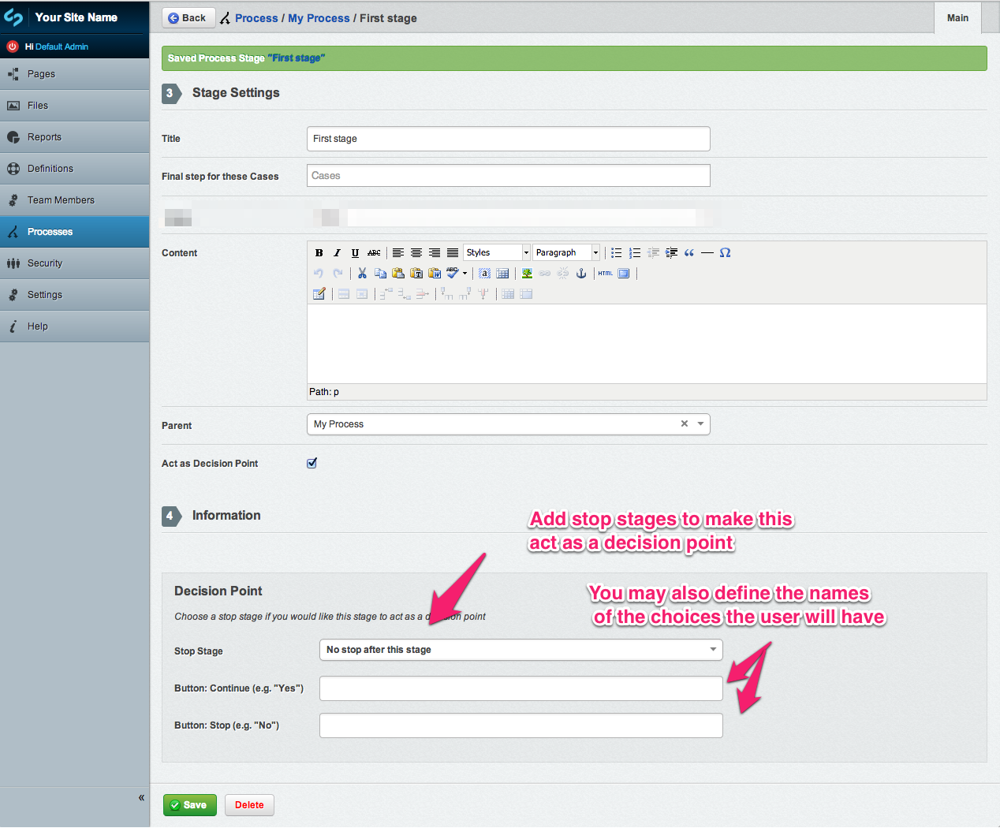
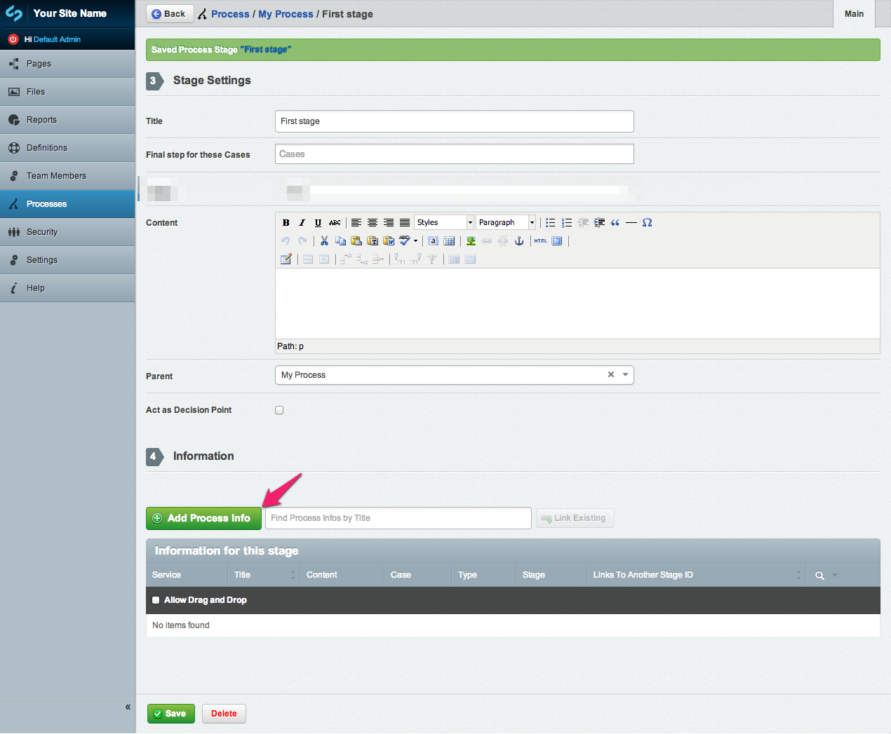
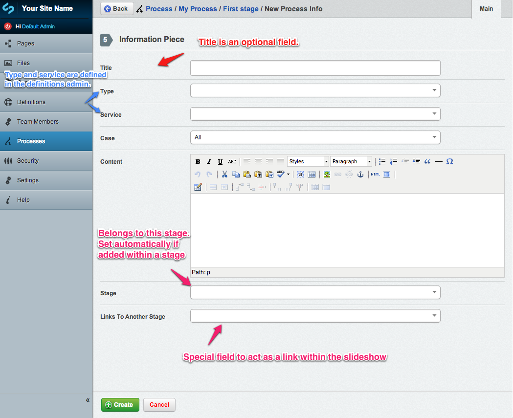

#Process Map User Help

_Inital view of process admin_

##Terminology
* Case: A case is a means of classifying information in order to filter that info to different audiences. In the default template case filtering assumes the first step is chosing a case. 
* Stage: A stage respresents a single step in a process. The first step in the default template is case selection. Everything after that is user defined.
* Decision point: A decision point is anywhere in your process that you want users to make a choice. These choicdes currently result in either continuation of the flow (ie the next stage), or a stop stage. You may choice for any regular stage you add to act as a decision point, rather then an information step.
* Stop Stage: A stop stage is a stopping point in your process. These can be linked with decision point slides to provide final information after a user has selected a stop option
* Process Info/Information: Each piece of information that appears in a process map can be classified with meta data. This means that they can easily be filtered and categorized on the frontend.
* Process Display Page: The page type that lets you view your process on your website
* Process Admin: The modeladmin where you define your process

##Set up meta data
If you are using this with the Definitions module, first add your service and type definitions. Services are a way a providing agency -> url pairings. Types are a simplier classificarion, that could be used to style process info differently on the frontend

Examples of services:
* Police http://nzpolice.govt.nz
* ACC http://www.acc.co.nz

Examples of type definitions:
* Note
* Announcement
* Communication

Then go to "Processes" in the left hand navigation and add Process Cases. Once you have set up an initial process, you can then connect these process cases to that process.

## Adding a Process
Select the process tab, and add a process. Give your process a title. Once you save the record, you should have the ability to add stopping points and stages.

## Adding stopping points
Stop slides are for resolving decision points. Once you have an initial process saved, you can set up any or all of the stopping points in your process. It is helpful to have these set up before adding the main process stages (even without the associated information pieces).

##Adding a Stage (General or Decision Point)

Once you have an initial process, you may add stages. Stages may act as decision points *or* contain information pieces. Once you have saved a stage, you may add the details for these. 

Notes: 
* "Parent" will be set automatically when you save a record from within a process, so there is no need to set this each time.
* "Content" is optional and applies to all cases that can see this step.
* A slide will only act as a decision point when a stop slide is selected and will continue to act as a decision point until that stop is removed. You must select the act as Decision Point checkbox in order to display the area that lets you add and remove stop stages.
* Stop slides are for resolving decision points, and "Final step for these cases" only needs to be set if other cases continue on after this slide (i.e. there is no need to do anything special if this is the final slide for all steps)

##How can I make a case finish before other cases?
Each stage lets you define any cases you want to end early. Choose the relivent cases from the "Final step for these Cases" dropdown. This stage be the last see by users viewing these cases, so provide any special info you want them to have before leaving the process.
* Note: there is no need to select cases on a slide if it is the final slide for all cases.

##Adding information pieces

Once you have stages in your process you can add information to them. Depending on how you like to work, it may be worthwhile providing the outline of a process with all it's stages before adding the information to them. For ease of editing, the information pieces are also shown in the main modeladmin, once you are able to add and edit them. 

If you would like your information to inherit its title from a service definition, leave the "title" field blank.

"Links to another stage" refers to another visible stage in the current process. You only need to set this if you ould like your information piece to act as an internal link to another section of the processmap (you might do this if you want to reference a section that the user has already viewed).

Notes: 
* The Type and Services fields are defined in the Definitions admin and will not appear if you are not using the definitions admin, or have no definitions defined.

##Adding a Process Display Page
Once you have the basis of a process set up, you can set up a process display page. This is a generic page, with the additional feature of chosing a process to display. You may enter content here as you normally would, but it could be a good idea to keep it short.

